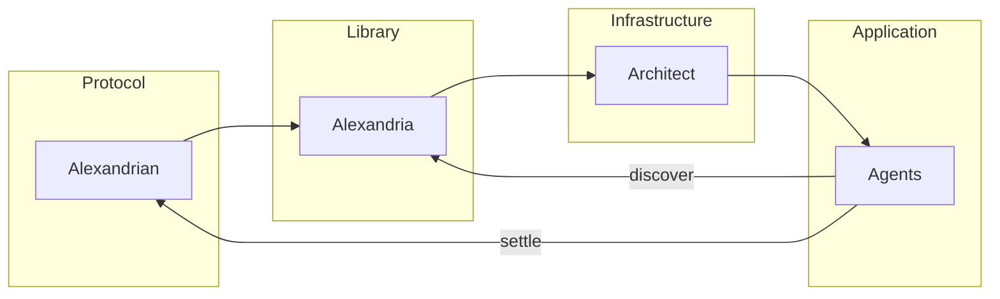

# Alexandria

Architecture for deterministic knowledge: on-chain provenance, atomic royalty settlement, and the Knowledge Block primitive (Alexandrian protocol + Alexandria library + infrastructure + agents).

---

## 🚀 Start Here

### Requirements

- **Node.js 20** (LTS)
- **pnpm**
- **Windows:** Protocol tests may hit a known Hardhat teardown; use WSL or CI if needed.

### One-command setup

Run the block below for the full setup (clone → enter repo → install deps → build → demo).

```bash
git clone https://github.com/alexandrian-protocol/alexandrian-protocol.git
cd alexandrian-protocol
pnpm start:here
```

**Already cloned?** Run `pnpm start:here` (install → build → demo).

### Manual steps

If you prefer to run each step yourself:

```bash
pnpm install
pnpm build
pnpm demo
```

---


## ✅ Milestone 1 — Complete

Milestone 1 establishes:

- Deterministic Knowledge Block identity
- On-chain registration
- Atomic settlement
- Indexable lineage

### Guarantees

| Guarantee | Enforced By | Proof |
|-----------|-------------|-------|
| Deterministic kbId | Canonical serialization invariant | `pnpm test:spec` |
| Stable contentHash + CIDv1 | Canonical byte derivation | `pnpm test:spec` |
| Unique on-chain registration | KnowledgeRegistry immutability | `pnpm test:protocol` |
| Atomic settlement (98/2) | Transaction-level execution | `pnpm test:protocol` |
| Royalty propagation | RoyaltyDAG deterministic routing | `pnpm test:protocol` |
| Schema validation | Graph integrity enforcement | `pnpm test:spec` |
| Queryable lineage | Subgraph indexing | [subgraph/](subgraph/README.md) |

---

## 🏗 Architecture Overview

See full definitions → [docs/README.md](docs/README.md)

Alexandrian separates protocol enforcement, infrastructure operation, and application intent into distinct layers.

### Components

**Alexandrian — Protocol Layer**

Defines the protocol primitive — the Knowledge Block — providing:

- Canonical identity
- Enforceable provenance
- Atomic royalty settlement

Identity is deterministic. State transitions are immutable.

**Alexandria — Library Layer**

Indexes and exposes Knowledge Blocks for discovery and query.

- Implements access and indexing logic
- Does not define protocol rules
- Does not influence settlement

**Architect (Operator) — Infrastructure**

Operates runtime infrastructure:

- Alexandria runtime
- Subgraph indexing
- Tooling and services

Protocol rules grant no privileged authority in settlement, ranking, or discovery.

**Agents (Scribes) — Application Layer**

Independent participants that:

- Discover Knowledge Blocks via Alexandria
- Settle economically via Alexandrian

Discovery is application-layer logic.  
Enforcement is protocol-layer logic.  
Intent remains agent-defined.

### Knowledge Block — Protocol Primitive

The fundamental unit of knowledge.

A structured, content-addressed envelope containing:

- knowledge payload
- provenance metadata
- economic attribution

---

## 🧭 Architectural Stack



**Flow:** Protocol (identity, settlement) → Library (index, query) → Infrastructure (runtime, subgraph) → Application (agents). Agents discover via Library, settle via Protocol. See [docs/README.md](docs/README.md).

---

## 🔭 Milestone 2 — Epistemic Accountability

M2 extends the Knowledge Block with economic accountability and observable trust: stake-backed publication and slashing, demand signals via settlement data (e.g. subgraph), cryptographically verifiable agent intent (e.g. EIP-712), and endorsement/slash as protocol-native reputation. The primitive’s **KB schema expands** to maximize agent usefulness and data tracking—new fields and events support demand, intent, and reputation without changing canonical identity or royalty invariants. One testnet demo in scope—and more.

| Feature | Enables | Surface |
|---------|---------|---------|
| totalFeesEarned | On-chain demand signal | Registry + subgraph |
| Endorsements | Multi-curator consensus | Protocol events |
| Slashing | Economic penalties | KBDeprecated → slash() |
| EIP-712 signing | Verifiable agent intent | Signed settlement |
| ERC-8004 compatibility | Agent interoperability | Interface layer |
| Base Sepolia subgraph | Public queryability | Graph Studio |

See [docs/milestones/](docs/milestones/) for reviewer entry.

---

## 📄 License

MIT — see [LICENSE](LICENSE).


