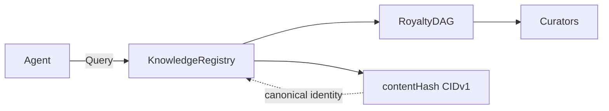

# Alexandria

Deterministic Knowledge Block identity, on-chain registry, and subgraph indexing.

---

## M1 — Complete (evidence)

Deterministic Knowledge Block identity, on-chain registry, and subgraph indexing.

**Evidence + commands:** [specs/M1-DEMO.md](specs/M1-DEMO.md) (accomplishments, proof of execution) · [specs/grants/COMMANDS.md](specs/grants/COMMANDS.md) (all commands and links).

**Reviewer entry point:** [specs/grants/](specs/grants/) — commands and links in one place.

---

## Architecture

[specs/grants/FILE-STRUCTURE.md](specs/grants/FILE-STRUCTURE.md)

**Alexandrian** is the protocol layer.
It defines the primitive — a Knowledge Block with canonical identity, enforceable provenance, and atomic royalty settlement. Identity is deterministic. State transitions are immutable.

**Alexandria** is the library layer.
It indexes, organizes, and exposes Knowledge Blocks for discovery and query. It implements access logic but does not define protocol rules.

**Agents** operate independently.
They discover Knowledge Blocks via Alexandria and settle economically via the Alexandrian Protocol. Discovery is application-layer logic. Settlement and enforcement are protocol-layer logic. Intent remains agent-defined.



*Chart: Agent → KnowledgeRegistry (query); Registry → RoyaltyDAG → Curators; contentHash CIDv1 = canonical identity. Renders in GitHub README.*

---

## M2 — Planned (not built)

**Planned work:** [specs/m2/README.md](specs/m2/README.md). Nothing in M2 is required for M1 verification.

---

## Start here

Clone, install, build (setup included):

```bash
git clone https://github.com/alexandrian-protocol/alexandrian-protocol.git && cd alexandrian-protocol && pnpm install && pnpm build
```

**Dependencies:** [specs/TROUBLESHOOTING.md](specs/TROUBLESHOOTING.md) (Node 20, pnpm). **Full commands:** [specs/grants/COMMANDS.md](specs/grants/COMMANDS.md) · [scripts/README.md](scripts/README.md).

---

## License

MIT. See [LICENSE](LICENSE).
