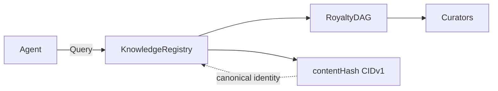

# Alexandria


**Alexandria** is the monorepo for the **Alexandrian Protocol**: deterministic, content-addressed knowledge infrastructure for AI agents. Canonical KBs (JCS/CIDv1), VirtualRegistry, Solidity contracts (KnowledgeRegistry), subgraph, SDK, and seeds.

Agents coordinate through shared state. The registry is that state: content-addressed KBs and a royalty DAG encode who contributed what. Stake is the coordination signal; derivation and attribution are first-class so agents build on each other’s outputs and get paid along the graph.



---

## M1 — Complete (evidence)

| Evidence | Command / link |
|----------|----------------|
| **CI** | [GitHub Actions](https://github.com/alexandrian-protocol/alexandrian-protocol/actions) — build + full test suite on push/PR |
| **One-command verify** | `pnpm verify` — install, build, tests, demo (see [specs/grants/COMMANDS.md](specs/grants/COMMANDS.md)) |
| **Demo** | `pnpm demo` or `pnpm demo:walkthrough` — KB created, CID verified, determinism proven |
| **Subgraph** | [Studio](https://thegraph.com/studio/subgraph/alexandria-protocol) · Query: `https://api.studio.thegraph.com/query/1742359/alexandria-protocol/v1` |
| **Testnet** | Deploy: `pnpm deploy:testnet`; addresses: [specs/TESTNET-ADDRESSES.md](specs/TESTNET-ADDRESSES.md) |
| **History** | [CHANGELOG.md](CHANGELOG.md) — M1 entry (canonical identity, registry, subgraph) |

**Reviewer entry point:** [specs/grants/](specs/grants/) — commands and links in one place.

---

## M2 — Planned (not built)

| Area | Planned |
|------|--------|
| Slash / deprecation | KBStaking, deprecateKB, KBDeprecated, supersededBy |
| Query metrics | queryCount, totalFeesEarned in subgraph |
| Smart accounts | ERC-165, ERC-1271, EIP-712 (skeletons in `contracts/m2/`) |
| Demo / testnet | Slashing harness, query metrics via subgraph |

Details: [specs/m2/](specs/m2/) — future work only; nothing in M2 is required for M1.

---

## Repo layout

| Path | Purpose |
|------|---------|
| **specs/** | Protocol specs, [grants/](specs/grants/) (reviewer entry), [m2/](specs/m2/) (planned work) |
| **packages/protocol** | Core: canonical serialization, VirtualRegistry, KnowledgeRegistry contracts |
| **packages/sdk** | Client SDK and CLI |
| **tests/** | Unit, invariants, integration, demo walkthrough, testnet smoke, subgraph |
| **subgraph/** | The Graph — schema, mapping, deploy to Studio |
| **seeds/** | 20 seed KBs (software.security, software.patterns, meta.alexandria) |
| **test-vectors/canonical** | Canonical envelope → contentHash/CID reference |
| **scripts/** | Deploy, register seeds, demo |
| **docker/** | Optional full local stack |

---

## Dependencies

- **Node.js 20 LTS** — [.nvmrc](.nvmrc) (CI and local use the same).
- **pnpm** — version from `packageManager` in [package.json](package.json) (e.g. `pnpm@9.0.0`). Install via [Corepack](https://nodejs.org/api/corepack.html) (`corepack enable` then `pnpm install`) or `npm install -g pnpm`.

---

## Setup (clone and install)

From a clean clone:

```bash
git clone https://github.com/alexandrian-protocol/alexandrian-protocol.git
cd alexandrian-protocol
```

Use Node 20 (optional if already on 20):

```bash
nvm use    # if using nvm and .nvmrc is present
# or: fnm use / volta use / etc.
```

Install dependencies and build:

```bash
pnpm install
pnpm build
```

Run the demo or full verification:

```bash
pnpm demo
# or full check (install + build + tests + demo):
pnpm verify
```

All scripts (build, test, deploy) are in [package.json](package.json); reviewer copy-paste: [specs/grants/COMMANDS.md](specs/grants/COMMANDS.md).

---

## License

[LICENSE](LICENSE).
